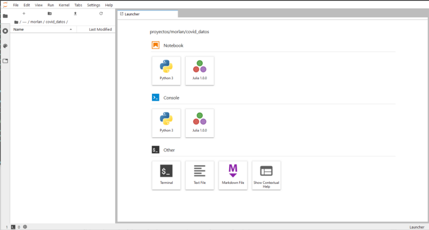

# Taller de visualización de datos, "Visualizando datos de COVID-19"

El objetivo de este taller es mostrar como se va construyendo una visualización de datos interactiva en la web. 

El taller consta de las siguientes partes:

* Descarga de los datos
* Análisis exploratorio de los datos
* Procesamiento de los datos
* Generación de insumos para la visualización de datos
* Generación de la visualización de datos

Usualmente para llevar a cabo una visualización de datos necesitamos procesar los datos y luego visualizarlos. Son dos procesos diferentes, aunque ambos invloucran la realización de gráficas. Es importante separar estos procesos. Cada uno de los procesos se realiza con tecnologías diferentes.

El procesamiento de datos se lleva a cabo utilizando lenguajes de programación con capacidades de análisis de datos. Usualmente se utiliza Python o R. En este taller utilizaremos python.

La realización de visualñizaciones interactivas en la web también se puede hacer desde python o R a traves de algunas librerías con capacidades de visualización de datos interactiva, sin embargo la manera más versatil para visualizar datos es a traves de JavaScript. En este taller visualizaremos utilizando D3js.

## Instalar Python, Anaconda, Juputer Lab, Pandas, Bokeh y todo lo demás...

Para la parte de procesamiento de datos necesitarás instalar [python](https://www.python.org/) y algunas librerías para poder procesar y análizar datos de forma eficiente. 

La forma más fácil de instalar python y las librerías necesarias para analizar datos es a traves de [Anaconda](https://www.anaconda.com/products/individual).

También puedes intalar python por separado siguiendo las instrucciones en su [página](https://www.python.org/downloads/) y luego instalar cada una de las librerías necesarias.

Se puede trabajar con python de muchas maneras. Desde su interprete, desde archivos o scripts. Nosotros trabajaremos con python utilizando Notebooks de [Jupyter](https://jupyter.org/). Estos notebooks nos permiten ejecutar código de forma secuencial y manteniendo los resultados de las ejecuciones anteriores. 

Si instalaste python a traves de Anaconda, el ambiente de trabajo JupyterLab ya se encuentra en tu sistema. Si instalaste python a traves de la página de python o ya lo tenías necesitarás instalar [JupyterLab](https://jupyter.org/install.html).

Para poder analizar y visualizar datos usaremos la librería [Pandas](https://pandas.pydata.org/pandas-docs/stable/index.html) y la librería [Bokeh](https://docs.bokeh.org/en/latest/index.html). Si instalaste todo a traves de Anaconda ya los tienes en tu sistema, si necesitas intalarlos puedes seguir las instrucciones para instalar [Pandas](https://pandas.pydata.org/pandas-docs/stable/getting_started/index.html#getting-started) y [Bokeh](https://docs.bokeh.org/en/latest/docs/installation.html).

## Lanzar el Jupyter Lab

Para ocupar JupyterLab necesitas ejecutar el comando "Jupyter Lab" en tu terminal. Si estas en windows e instalaste anaconda tendras una nueva terminal llamada "Anaconda Terminal". Necesitas lanzar el Jupyter Lab desde ahí.

Jupyter Lab se ejecutará en una pestaña de tu explorador. Veras una pantalla similar a esta: 

.

Para comenzar un nuevo notebook basta con dar click en el boton "python 3" bajo la sección de Notebooks.

También existen otras maneras de usar lo Notebooks de Jupyter en otros ambientes, por ejemplo con el editor de texto [VSCode](https://code.visualstudio.com/). Solamente necesitas descargarlo e instalar el complemento para python. Una vez que lo abras e instales el complemento puedes abrir un nuevo notebook desde la pantalla de bienvenida al complemento o presionando Ctrl+Shift+P, buscando python en el cuadro de texto disponible y seleccionando: "Python, create new blank jupyter notebook". 

De cualquiera de las dos maneras tendrás un Notebook nuevecito para trabajar, con una celda disponible. A medida que vayas escribiendo y ejecutando código en esta celda aparecerá el resultado de la ejecución y una nueva celda para seguir trabajando.

La siguiente parte del tutorial tendrás que teclearla en el notebook que acabas de crear.

## Manejo de datos en python

La primera parte del tutorial es en python. Si seguiste las instrucciones para instalarlo en tu sistema puedes encontrar la parte de python en el archivo "taller_python.ipynb" en este repositorio. Te recomiendo que no solo lo leas, codéalo! No hay manera de aprender a analizar, manipular y visualizar datos si no es haciendolo. El archivo puedes abrirlo en el enlace, leerlo e ir tecleando las partes de código en tu propio jupyter notebook.

En esta parte del tutorial se lleva a cabo la descarga, manipulación, análisis y procesamiento de los datos. No te la saltes!

[Enlace a la parte de python del tutorial](https://nbviewer.jupyter.org/github/irvingfisica/taller01/blob/master/taller_python.ipynb)

## Visualización de datos en la web

Aquí irá la descripción del proyecto en la versión web.